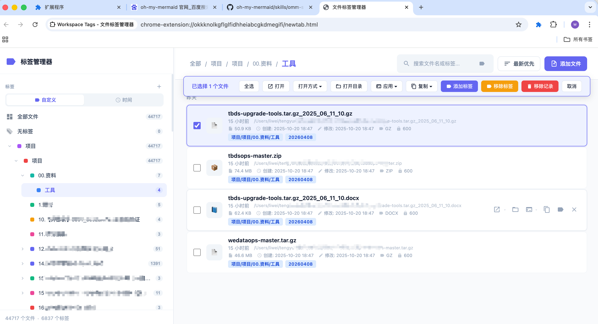

# Workspace Tags - 文件标签管理器

一个 Chrome 浏览器插件，**替换新标签页为全屏文件管理界面**，支持标签分类、时间排序和筛选功能。

## 📸 界面预览



## ✨ 功能特性

- 📁 **文件管理**：添加文件引用，支持拖拽添加
- 🏷️ **标签系统**：为文件添加自定义标签（如 Hadoop、HBase、TE）
- 📅 **时间排序**：按文件添加时间排序，支持正序/倒序一键切换
- 🔍 **搜索过滤**：支持按文件名、路径、标签搜索
- 🎯 **标签筛选**：左侧边栏标签导航，点击快速筛选
- 📊 **日期分组**：文件按日期自动分组显示（今天、昨天、具体日期）
- ⌨️ **快捷键**：`Ctrl+N` 添加文件，`Ctrl+F` 聚焦搜索
- 💾 **数据持久化**：所有数据保存在 Chrome 本地存储中

## 📦 安装方式

1. 打开 Chrome 浏览器，访问 `chrome://extensions/`
2. 开启右上角的 **"开发者模式"**
3. 点击 **"加载已解压的扩展程序"**
4. 选择本项目文件夹 `workspace-tags`
5. 打开一个新标签页，即可看到全屏的文件标签管理器

### 🔧 安装 Native Host（可选，用于手动输入路径读取目录）

如果需要通过**手动输入路径**来导入目录文件（而不是通过文件选择器），需要安装 Native Messaging Host：

1. 确保已安装 **Python 3**
2. 在 `chrome://extensions/` 页面找到 **Workspace Tags** 扩展的 **ID**（一串字母数字字符串）
3. 运行安装脚本：
   ```bash
   cd workspace-tags/native-host
   bash install.sh <你的扩展ID>
   ```
4. 重新加载 Chrome 扩展

> **注意**：安装脚本目前支持 macOS。Native Host 用于让扩展能够读取指定路径下的文件列表。

## 🚀 使用指南

### 添加文件
- 点击顶部工具栏 **"添加文件"** 按钮（或 `Ctrl+N`）
- 输入文件名、路径、标签后确认
- 也可以直接拖拽文件到主内容区域

### 管理标签
- 左侧边栏显示所有标签，点击可筛选
- 点击侧边栏 "管理" 旁的 "+" 按钮创建/删除标签
- 文件卡片悬停时，点击标签图标为文件添加/移除标签

### 排序切换
- 工具栏排序按钮可在 "最新优先" 和 "最早优先" 之间切换

## 🏗️ 项目结构

```
workspace-tags/
├── manifest.json      # Chrome 插件配置（MV3 新标签页覆盖）
├── newtab.html        # 全屏新标签页
├── app.js             # 核心逻辑
├── styles.css         # 全屏响应式样式
├── background.js      # 后台脚本（Native Messaging 通信）
├── native-host/       # Native Messaging Host（本地文件读取）
│   ├── read_dir.py    # Python 脚本，读取目录内容
│   └── install.sh     # 安装脚本（注册 Native Host）
├── icons/             # 插件图标
└── README.md
```

## ⚙️ 技术栈

- Chrome Extension Manifest V3（`chrome_url_overrides.newtab`）
- 原生 JavaScript（零依赖）
- Chrome Storage API
- CSS Grid / Flexbox 响应式布局

## 📄 License

MIT
